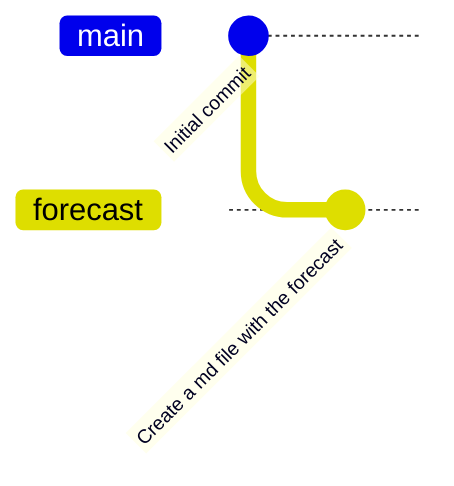
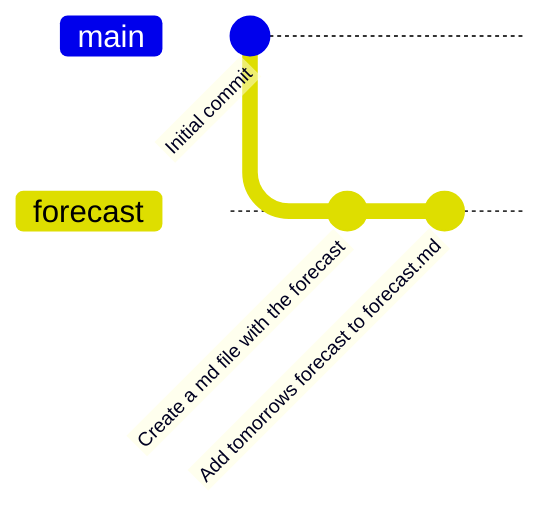
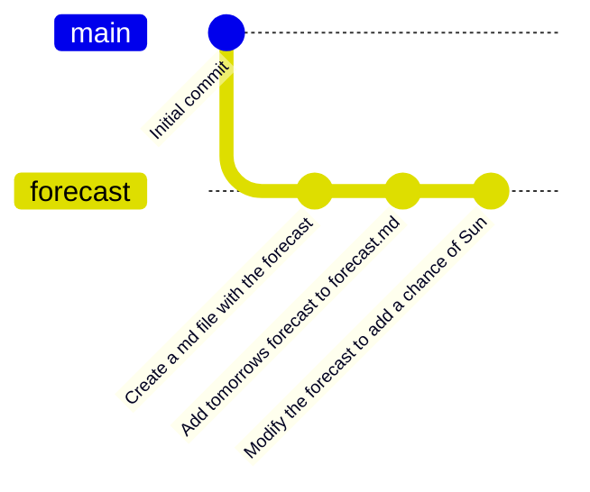

::::::::::::::::::::::::::::::::::::::: objectives

- Go through the modify-add-commit cycle for one or more files.
- Explain where information is stored at each stage of that cycle.
- Distinguish between descriptive and non-descriptive commit messages.

::::::::::::::::::::::::::::::::::::::::::::::::::

:::::::::::::::::::::::::::::::::::::::: questions

- How do I record changes in Git?
- How do I check the status of my version control repository?
- How do I record notes about what changes I made and why?

::::::::::::::::::::::::::::::::::::::::::::::::::

First let's make sure we're still on the right branch.
You should be on the `forecast` branch:

```bash
$ git switch forecast
```

Let's create a file called `forecast.md` that contains a basic weather forecast.
We'll use `nano` to edit the file;
you can use whatever editor you like.
In particular, this does not have to be the `core.editor` you set globally earlier. But remember, the steps to create create or edit a new file will depend on the editor you choose (it might not be nano). For a refresher on text editors, check out ["Which Editor?"](https://swcarpentry.github.io/shell-novice/03-create.html#which-editor) in [The Unix Shell](https://swcarpentry.github.io/shell-novice/) lesson.

```bash
$ nano forecast.md
```

Type the text below into the `forecast.md` file:

```output
# Forecast

## Today

Cloudy with a chance of pizza.
```

Save the file and exit your editor.
Next, let’s verify that the file was properly created by running the list command (`ls`):

```bash
$ ls
```

```output
forecast.md
```

`forecast.md` contains three lines, which we can see by running:

```bash
$ cat forecast.md
```

```output
# Forecast

## Today

Cloudy with a chance of pizza.
```

If we check the status of our project again,
Git tells us that it's noticed the new file:

```bash
$ git status
```

```output
On branch forecast

No commits yet

Untracked files:
   (use "git add <file>..." to include in what will be committed)

	forecast.md

nothing added to commit but untracked files present (use "git add" to track)
```

The "untracked files" message means that there's a file in the directory
that Git isn't keeping track of.
We can tell Git to track a file using `git add`:

```bash
$ git add forecast.md
```

and then check that the right thing happened:

```bash
$ git status
```

```output
On branch forecast

No commits yet

Changes to be committed:
  (use "git rm --cached <file>..." to unstage)

	new file:   forecast.md
```

Git now knows that it's supposed to keep track of `forecast.md`,
but it hasn't recorded these changes as a commit yet.
To get it to do that,
we need to run one more command:

```bash
$ git commit -m "Create a md file with the forecast"
```

```output
[forecast f22b25e] Create a md file with the forecast
 1 file changed, 5 insertions(+)
 create mode 100644 forecast.md
```

When we run `git commit`,
Git takes everything we have told it to save by using `git add`
and stores a copy permanently inside the special `.git` directory.
This permanent copy is called a [commit](../learners/reference.md#commit)
(or [revision](../learners/reference.md#revision)) and its short identifier is `f22b25e`.
Your commit may have another identifier.

We use the `-m` flag (for "message")
to record a short, descriptive, and specific comment that will help us remember later on what we did and why.
If we just run `git commit` without the `-m` option,
Git will launch `nano` (or whatever other editor we configured as `core.editor`)
so that we can write a longer message.

[Good commit messages][commit-messages] start with a brief (\<50 characters) statement about the
changes made in the commit. Generally, the message should complete the sentence "If applied, this commit will" <commit message here>.
If you want to go into more detail, add a blank line between the summary line and your additional notes. Use this additional space to explain why you made changes and/or what their impact will be.

::::::::::::::::::::::::::::::::::::: instructor

The [whatthecommit site](https://whatthecommit.com/) can be used to show 
example commit messages, good and bad, pulled from public repos on GitHub.
You should note that there is no safe for work filter. Some of the commit 
messages may include inappropriate language.

:::::::::::::::::::::::::::::::::::::::::::::::::

::: caution

### Using `git add .`

Using `git add .` or the `-a` flag with `git commit` will add **all**
your unstaged changes in your repository.

This might include things you didn't mean to add.
**Always use `git status` to check your changes before adding them.**
We recommend you avoid using `git add .` and `git commit -a`.
:::

::: spoiler

### FCM Comparison

Running `git add` followed by `git commit` is equivalent to:

```bash
$ fcm commit
```

:::

Our repository now looks like this:



If we run `git status` now:

```bash
$ git status
```

```output
On branch forecast
nothing to commit, working tree clean
```

it tells us everything is up to date.

:::::::::::::::::::::::::::::::::::::::::  callout

## Where Are My Changes?

If we run `ls` at this point, we will still see just our two files,
`README.md` and `forecast.md`.
That's because Git saves information about files' history
in the special `.git` directory mentioned earlier
so that our filesystem doesn't become cluttered
(and so that we can't accidentally edit or delete an old version).


::::::::::::::::::::::::::::::::::::::::::::::::::

Now suppose you want to more information to the file.
(Again, we'll edit with `nano` and then `cat` the file to show its contents;
you may use a different editor, and don't need to `cat`.)

```bash
$ nano forecast.md
$ cat forecast.md
```

```output
# Forecast

## Today

Cloudy with a chance of pizza.

## Tomorrow

Morning rainbows followed by light showers.
```

When we run `git status` now,
it tells us that a file it already knows about has been modified:

```bash
$ git status
```

```output
On branch forecast
Changes not staged for commit:
  (use "git add <file>..." to update what will be committed)
  (use "git restore <file>..." to discard changes in working directory)

	modified:   forecast.md

no changes added to commit (use "git add" and/or "git commit -a")
```

The last line is the key phrase:
"no changes added to commit".
We have changed this file,
but we haven't told Git we will want to save those changes
(which we do with `git add`)
nor have we saved them (which we do with `git commit`).
So let's do that now. It is good practice to always review
our changes before saving them. We do this using `git diff`.
This shows us the differences between the current state
of the file and the most recently saved version:

```bash
$ git diff
```

```output
diff --git a/forecast.md b/forecast.md
index df0654a..315bf3a 100644
--- a/forecast.md
+++ b/forecast.md
@@ -3,3 +3,7 @@
 ## Today
 
 Cloudy with a chance of pizza.
+
+## Tomorrow
+
+Morning rainbows followed by light showers.
```

The output is cryptic because
it is actually a series of commands for tools like editors and `patch`
telling them how to reconstruct one file given the other.
If we break it down into pieces:

1. The first line tells us that Git is producing output similar to the Unix `diff` command
  comparing the old and new versions of the file.
2. The second line tells exactly which versions of the file
  Git is comparing;
  `df0654a` and `315bf3a` are unique computer-generated labels for those versions.
3. The third and fourth lines once again show the name of the file being changed.
4. The remaining lines are the most interesting, they show us the actual differences
  and the lines on which they occur.
  In particular,
  the `+` marker in the first column shows where we added a line.

::: callout

### git difftool

[git-difftool](https://git-scm.com/docs/git-difftool) lets you compare and 
edit files using your preferred diff tool.

```bash
$ git difftool -g
```

The `-g` flag launches the default gui diff tool. To change defaults:

```bash
git config --global diff.tool <tool>
git config --global diff.guitool <gui-tool>
git config --global difftool.prompt false
git config --global difftool.guiDefault auto
```

Where `<tool>` is a diffing tool such as Vim,
`<gui-tool>` is your preferred graphical user interface
diffing tool such as [meld](https://gnome.pages.gitlab.gnome.org/meld/).
The third line disables the Git prompt which asks you to confirm
whether to launch the diff for every changed file.
The last line automatically detects support for launching the
gui based tool and launches `<gui-tool>` preferentially
over `<tool>`. With this set to auto there is no need to
add the `-g` flag when running `git difftool`.

To see a list of available tools run:

```bash
$ git difftool --tool-help
```

:::

After reviewing our change, it's time to commit it:

```bash
$ git commit -m "Add tomorrows forecast to forecast.md"
```

```output
On branch forecast
Changes not staged for commit:
  (use "git add <file>..." to update what will be committed)
  (use "git restore <file>..." to discard changes in working directory)

	modified:   forecast.md

no changes added to commit (use "git add" and/or "git commit -a")
```

Whoops:
Git won't commit because we didn't use `git add` first.
Let's fix that:

```bash
$ git add forecast.md
$ git commit -m "Add tomorrows forecast to forecast.md"
```

```output
[forecast 34961b1] Add tomorrows forecast to forecast.md
 1 file changed, 4 insertions(+)
```

Git insists that we add files to the set we want to commit
before actually committing anything. This allows us to commit our
changes in stages and capture changes in logical portions rather than
only large batches.
For example,
suppose we're adding a few citations to relevant research to our thesis.
We might want to commit those additions,
and the corresponding bibliography entries,
but *not* commit some of our work drafting the conclusion
(which we haven't finished yet).

To allow for this,
Git has a special *staging area*
where it keeps track of things that have been added to
the current [changeset](../learners/reference.md#changeset)
but not yet committed.

:::::::::::::::::::::::::::::::::::::::::  callout

## Staging Area

If you think of Git as taking snapshots of changes over the life of a project,
`git add` specifies *what* will go in a snapshot
(putting things in the staging area),
and `git commit` then *actually takes* the snapshot, and
makes a permanent record of it (as a commit).
If you don't have anything staged when you type `git commit`,
Git will prompt you to use `git commit -a` or `git commit --all`,
which is kind of like gathering *everyone* to take a group photo!
However, it's almost always better to
explicitly add things to the staging area, because you might
commit changes you forgot you made. (Going back to the group photo simile,
you might get an extra with incomplete makeup walking on
the stage for the picture because you used `-a`!)
Try to stage things manually,
or you might find yourself searching for "git undo commit" more
than you would like!


::::::::::::::::::::::::::::::::::::::::::::::::::

{alt='A diagram showing how "git add" registers changes in the staging area, while "git commit" moves changes from the staging area to the repository'}

::: spoiler

### FCM Comparison

In FCM there is no concept of a staging area.
FCM will commit all file modifications at once.
This can lead to rather large commits.
In Git remember to break down commits into small logical chunks.

```bash
$ git add <file>
$ git commit
```

is equivalent to:

```bash
$ fcm commit
```

:::

Our repository now looks like this:



Let's watch as our changes to a file move from our editor
to the staging area
and into long-term storage.
First,
we'll improve our forecast by changing 'pizza' to 'Sun':

```bash
$ nano forecast.md
$ cat forecast.md
```

```output
# Forecast

## Today

Cloudy with a chance of Sun.

## Tomorrow

Morning rainbows followed by light showers.
```

```bash
$ git diff
```

```output
diff --git a/forecast.md b/forecast.md
index 315bf3a..b36abfd 100644
--- a/forecast.md
+++ b/forecast.md
@@ -2,7 +2,7 @@
 
 ## Today
 
-Cloudy with a chance of pizza.
+Cloudy with a chance of Sun.
 
 ## Tomorrow

```

So far, so good:
we've replaced one line (shown with a `-` in the first column) with a new line
(shown with a `+` in the first column).
Now let's put that change in the staging area
and see what `git diff` reports:

```bash
$ git add forecast.md
$ git diff
```

There is no output:
as far as Git can tell,
there's no difference between what it's been asked to save permanently
and what's currently in the directory.
However, if we do this:

```bash
$ git diff --staged
```

```output
diff --git a/forecast.md b/forecast.md
index 315bf3a..b36abfd 100644
--- a/forecast.md
+++ b/forecast.md
@@ -2,7 +2,7 @@
 
 ## Today
 
-Cloudy with a chance of pizza.
+Cloudy with a chance of Sun.
 
 ## Tomorrow

```

it shows us the difference between
the last committed change
and what's in the staging area.
Let's save our changes:

```bash
$ git commit -m "Modify the forecast to add a chance of Sun"
```

```output
[forecast 005937f] Modify the forecast to add a chance of Sun
 1 file changed, 1 insertion(+), 1 deletion(-)
```

check our status:

```bash
$ git status
```

```output
On branch forecast
nothing to commit, working tree clean
```

Our repository now looks like this:



:::::::::::::::::::::::::::::::::::::::::  callout

## Word-based diffing

Sometimes, e.g. in the case of the text documents a line-wise
diff is too coarse. That is where the `--color-words` option of
`git diff` comes in very useful as it highlights the changed
words using colors.


::::::::::::::::::::::::::::::::::::::::::::::::::

:::::::::::::::::::::::::::::::::::::::::  callout

## Directories

Two important facts you should know about directories in Git.

1. Git does not track directories on their own, only files within them.
  Try it for yourself:
  
  ```bash
  $ mkdir symbols
  $ git status
  $ git add symbols
  $ git status
  ```
  
  Note, our newly created empty directory `symbols` does not appear in
  the list of untracked files even if we explicitly add it (*via* `git add`) to our
  repository. This is the reason why you will sometimes see `.gitkeep` files
  in otherwise empty directories. Unlike `.gitignore`, these files are not special
  and their sole purpose is to populate a directory so that Git adds it to
  the repository. In fact, you can name such files anything you like.

2. If you create a directory in your Git repository and populate it with files,
  you can add all files in the directory at once by:
  
  ```bash
  $ git add <directory-with-files>
  ```
  
  Try it for yourself:
  
  ```bash
  $ touch symbols/pressure.md symbols/pollen.md
  $ git status
  $ git add symbols
  $ git status
  ```
  
  Before moving on, we will commit these changes.
  
  ```bash
  $ git commit -m "Add some initial weather symbols"
  ```

::::::::::::::::::::::::::::::::::::::::::::::::::

To recap, when we want to add changes to our repository,
we first need to add the changed files to the staging area
(`git add`) and then commit the staged changes to the
repository (`git commit`):

{alt='A diagram showing two documents being separately staged using git add, before being combined into one commit using git commit'}

:::::::::::::::::::::::::::::::::::::::  challenge

## Choosing a Commit Message

Which of the following commit messages would be most appropriate for the
last commit made to `forecast.md`?

1. "Changes"
2. "Modify the forecast"
3. "Modify the forecast to add a chance of Sun"

:::::::::::::::  solution

## Solution

Answer 1 is not descriptive enough, and the purpose of the commit is unclear;
and answer 2 is redundant to using "git diff" to see what changed in this commit;
but answer 3 is good: short, descriptive, and imperative.


:::::::::::::::::::::::::

::::::::::::::::::::::::::::::::::::::::::::::::::

:::::::::::::::::::::::::::::::::::::::  challenge

## Committing Changes to Git

Which command(s) below would save the changes of `myfile.txt`
to my local Git repository?

1. ```bash
   $ git commit -m "my recent changes"
   ```
2. ```bash
   $ git init myfile.txt
   $ git commit -m "my recent changes"
   ```
3. ```bash
   $ git add myfile.txt
   $ git commit -m "my recent changes"
   ```
4. ```bash
   $ git commit -m myfile.txt "my recent changes"
   ```

:::::::::::::::  solution

## Solution

1. Would only create a commit if files have already been staged.
2. Would try to create a new repository.
3. Is correct: first add the file to the staging area, then commit.
4. Would try to commit a file "my recent changes" with the message myfile.txt.
  
  

:::::::::::::::::::::::::

::::::::::::::::::::::::::::::::::::::::::::::::::

:::::::::::::::::::::::::::::::::::::::  challenge

## Committing Multiple Files

The staging area can hold changes from any number of files
that you want to commit as a single snapshot.

1. Add some text to `forecast.md` noting the expected temperature.
2. Create a new file `atlas.md` with a list of common weather such as
   rain, sunshine, fog etc.
3. Add changes from both files to the staging area,
   and commit those changes.

:::::::::::::::  solution

## Solution

First we make our changes to the `forecast.md` and `atlas.md` files:

```bash
$ nano forecast.md
$ cat forecast.md
```

```output
# Forecast

## Today

Cloudy with a chance of sun.
Mild temperatures around 16 °C.

## Tomorrow

Morning rainbows followed by light showers.
```

```bash
$ nano atlas.md
$ cat atlas.md
```

```output
# Weather Atlas

- rain
- sunshine
- fog
```

Now you can add both files to the staging area. We can do that in one line:

```bash
$ git add forecast.md atlas.md
```

Or with multiple commands:

```bash
$ git add forecast.md
$ git add atlas.md
```

Now the files are ready to commit. You can check that using `git status`.
If you are ready to commit use:

```bash
$ git commit -m "Add in the temperature to the forecast and create the weather atlas file"
```

```output
[forecast cc127c2] Add in the temperature to the forecast and create the weather atlas file
 2 files changed, 6 insertions(+)
 create mode 100644 atlas.md
```

:::::::::::::::::::::::::

::::::::::::::::::::::::::::::::::::::::::::::::::

:::::::::::::::::::::::::::::::::::::::  challenge

## `bio` Repository

- Create a new Git repository on your computer called `bio`.
- Write a three-line biography for yourself in a file called `me.txt`,
  commit your changes.
- Modify one line, add a fourth line
- Display the differences.
  between its updated state and its original state.

:::::::::::::::  solution

## Solution

If needed, move out of the `weather` folder:

```bash
$ cd ..
```

Create a new folder called `bio` and 'move' into it:

```bash
$ mkdir bio
$ cd bio
```

Initialise the repository:

```bash
$ git init
```

Create your biography file `me.txt` using `nano` or another text editor.
Once in place, add and commit it to the repository:

```bash
$ git add me.txt
$ git commit -m "Add biography file"
```

Modify the file as described (modify one line, add a fourth line).
To display the differences
between its updated state and its original state, use `git diff`:

```bash
$ git diff me.txt
```

:::::::::::::::::::::::::

::::::::::::::::::::::::::::::::::::::::::::::::::


[commit-messages]: https://chris.beams.io/posts/git-commit/
[git-references]: https://git-scm.com/book/en/v2/Git-Internals-Git-References


:::::::::::::::::::::::::::::::::::::::: keypoints

- `git status` shows the status of a repository.
- Files can be stored in a project's working directory (which users see), the staging area (where the next commit is being built up) and the local repository (where commits are permanently recorded).
- `git add` puts files in the staging area.
- `git commit` saves the staged content as a new commit in the local repository.
- Write a commit message that accurately describes your changes.

::::::::::::::::::::::::::::::::::::::::::::::::::
