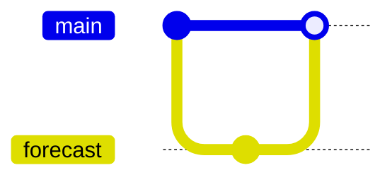
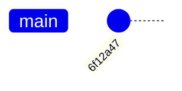
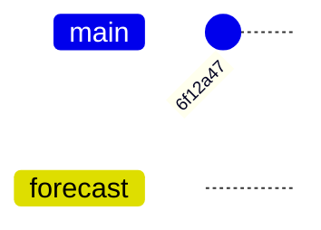

::::::::::::::::::::::::::::::::::::::: objectives

- What are branches?
- How do I view the current branches?
- How do I manipulate branches?

::::::::::::::::::::::::::::::::::::::::::::::::::

:::::::::::::::::::::::::::::::::::::::: questions

- Understand how branches are created.
- Learn the key commands to view and manipulate branches.

::::::::::::::::::::::::::::::::::::::::::::::::::

Branching is a feature available in most modern version control systems.
Branching in other version control systems can be an expensive operation in both time and disk space.
In Git, branches are a part of your everyday development process.

So far we have been working on the `main` branch
and have made one commit, the **root-commit**.
Committing the initial **root-commit** is the only time you should commit to `main`.
When you want to add a new change or fix a bug, no matter how big or how 
small, you create a new branch for your changes.
This makes it harder for unstable code to get merged into the main code base, 
and it gives you the chance to clean up your branch history before merging it into the main branch.



If you completed the pre-workshop [setup instructions for git autocomplete](learners/setup.md#git-autocomplete)
you should see the current branch, `main`, in your terminal prompt:

```
[~/Desktop/weather]:(main =)$
```

The `git status` command also shows us the current branch:

```bash
$ git status
```

```output
On branch main
nothing to commit, working tree clean
```

The phrase **working tree clean** means there are no changes
in your working directory and the current state of your
repository is identical to the last commit.

::: spoiler

### FCM Comparison

`main` == `trunk`

In an earlier episode we set our default branch
to be called `main`.
This is where our stable production code
lives and is equivalent to `trunk`.

We could have also named this branch `trunk` in Git.
We chose `main` as it is a more common default branch name
for Git and matches the default on GitHub.

:::

## Creating Branches

Our current repository looks something like this:



To make any changes we should create a new branch.
There are several ways to create a branch and switch to the new branch.
While it's good to be aware of all these different methods we
recommend using `git switch -c`.

You should ensure the branch has a suitable unique name 
which will help you identify what the branch is for; even after several 
months of inactivity.

We are going to add a weather forecast to our repository
so our branch will be named **forecast**:

::: tab

### git switch -c

`git switch` is a more modern command to navigate between branches.
`git switch` used with the `-c` flag automatically creates and 
switches you to a new branch:

```bash
$ git switch -c forecast
```

```output
Switched to branch 'forecast'
```

### git branch

To create a new branch use `git branch <branch-name>`:

```bash
$ git branch forecast
```

Now run `git status` and you will see you're still on the main branch.
To navigate between branches use `git switch <branch-name>`:

```bash
$ git switch forecast
```

```output
Switched to branch 'forecast'
```

### git checkout -b

The `git checkout` command can also be used to navigate between branches.
`git checkout` used with the `-b` flag automatically
creates and switches you to the new branch:

```bash
$ git checkout -b forecast
```

```output
Switched to branch 'forecast'
```

:::

Running `git status` now should output:

```bash
$ git status
```

```output
On branch forecast
nothing to commit, working tree clean
```

Now we have created but not committed anything to this new branch
so our repository looks like this:



If we run `git branch` we can see the branches that exist in our repository.

```bash
$ git branch
```

```output
* forecast
  main
```

The `*` indicates we are now on the `forecast` branch.

::: caution

### Unique Branch Names

To avoid creating a branch with the same name
as a collaborators branch it is common to prefix
the branch name with an Issue (ticket) number.

You might choose to include your initials or
username in your branch although this is less
common than an Issue number.

Separate words in branch names with `-` or `_`
depending on your teams working practices.
The [Git & GitHub Working Practices lesson](https://www.astropython.com/git-working-practices/),
which you can take after this introductory lesson,
will help you choose the working practices
that are right for you and your team.

:::

::::::::::::::::::::::::::::::::::::: challenge

## Switching Between Branches

How would you switch back to the `main` branch from the `forecast` branch?

:::::::::::::::: solution

```bash
$ git switch main
```

:::::::::::::::::::::::::
:::::::::::::::::::::::::::::::::::::::::::::::

::::::::::::::::::::::::::::::::::::: challenge

## Typos when creating branches

Help! Luca made a typo when naming their branch, `seesonal-forecast`,
how can they fix the branch name?

Hint: Look at the git documentation for the `git branch` command.

:::::::::::::::: solution

The `-m` flag used with `git branch` lets you rename a branch.

```bash
$ git branch -m <old-branch-name> <new-branch-name>
```

:::::::::::::::::::::::::
:::::::::::::::::::::::::::::::::::::::::::::::

::::::::::::::::::::::::::::::::::::: challenge

## Branch start-points

The commands we used above created a branch from the 
`HEAD` of the `main` branch 
because we ran `git switch` from `main`.
How would you create a branch that branched off at an
earlier commit that isn't `HEAD`? 

Hint: Look at the git documentation for the `git switch` command.

:::::::::::::::: solution

The `git switch` command lets you define a `<start-point>` to
branch from:

```bash
$ git switch -c <branch-name> <start-point>
```

`<branch-name>` is the name of the new branch.
`<start-point>` can be a branch name, a commit-id, or a tag.

This functionality also applies to the `git branch` command:

```bash
git branch <branch-name> <start-point>
```

:::::::::::::::::::::::::
:::::::::::::::::::::::::::::::::::::::::::::::

## Deleting Branches

A colleague of yours gets really excited about using branches and creates a new one:

```bash
$ git switch -c shipping-forecast
```

```output
Switched to a new branch 'shipping-forecast'
```

They then check their branches:

```bash
$ git branch -vv
```

```output
  forecast          6f12a47 Initial commit
  main              6f12a47 Initial commit
* shipping-forecast 6f12a47 Initial commit
```

Your colleague decides to delete the branch
since today's shipping forecast isn't ready.
To delete a branch first switch to any other branch:

```bash
$ git switch forecast
```

and then delete the branch with `git branch -d`:

```bash
$ git branch -d shipping-forecast
```

```output
Deleted branch shipping-forecast (was 6f12a47).
```

::: callout

## Check your branch point

Always switch to the branch you want to branch from, usually `main`,
or explicitly specify a branch point when creating new branches.
This helps avoid accidentally branching of a branch
which isn't `main` if you didn't mean to.

Imagine a colleague has added more files to their `forecast` branch
and just created a `tidal-forecast` branch.

They run:

```git
$ git branch -vv
```

```output
  forecast       8136c6f Add in a seasonal forecasts file
  main           6f12a47 Initial commit
* tidal-forecast 8136c6f Add in a seasonal forecasts file
```

Here the hash for the `tidal-forecast` branch is the same
as the `forecast` branch so `tidal-forecast`
is not branched off `main`.
If they meant to branch off `main` they should delete this branch,
and re-create it from the correct branch point.

:::

::::::::::::::::::::::::::::::::::::: challenge

## Deleting a branch that is checked out

What happens if you:

1. Create a new branch and switch to it
2. Try to delete the new branch while it's checked out

:::::::::::::::: solution

Git won't let you delete a branch you are currently on!
Try it for yourself:

```bash
$ git switch -c climate
$ git branch -D climate
```

```output
error: Cannot delete branch 'climate' checked out at '~/Documents/weather'
```

Note that even with the `-D`, force delete, flag the branch wasn't deleted.

:::::::::::::::::::::::::
:::::::::::::::::::::::::::::::::::::::::::::::

:::::::::::::::::::::::::::::::::::::::: keypoints

- `git status` shows you the branch you're currently on.
- `git switch -c <branch-name>` creates a new branch and switches you to it.
  Make sure you know what branch you are branching from before using `git switch` without a start-point!
- `git switch -c <branch-name> <start-point>` lets you define the start-point to branch off, via another branch name, a commit ID, or a tag.
- `git switch <branch-name>` switches you to another branch that already exists.
- `git branch -vv` shows you all the branches in the repository.
- `git branch -m <old-branch-name> <new-branch-name>` renames branches.
- `git branch -d <branch-name>` deletes a branch. Use the `-D` flag instead of `-d` to force delete the branch.

::::::::::::::::::::::::::::::::::::::::::::::::::
