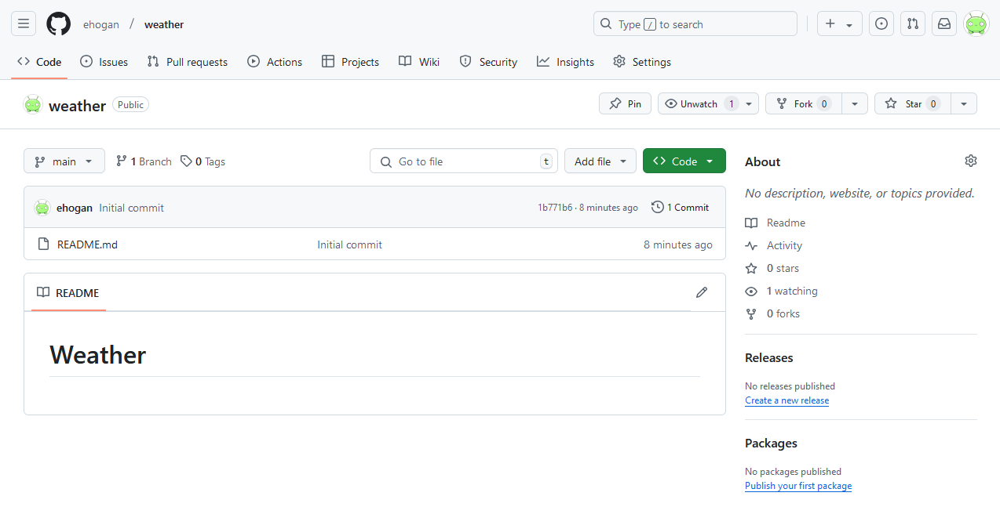
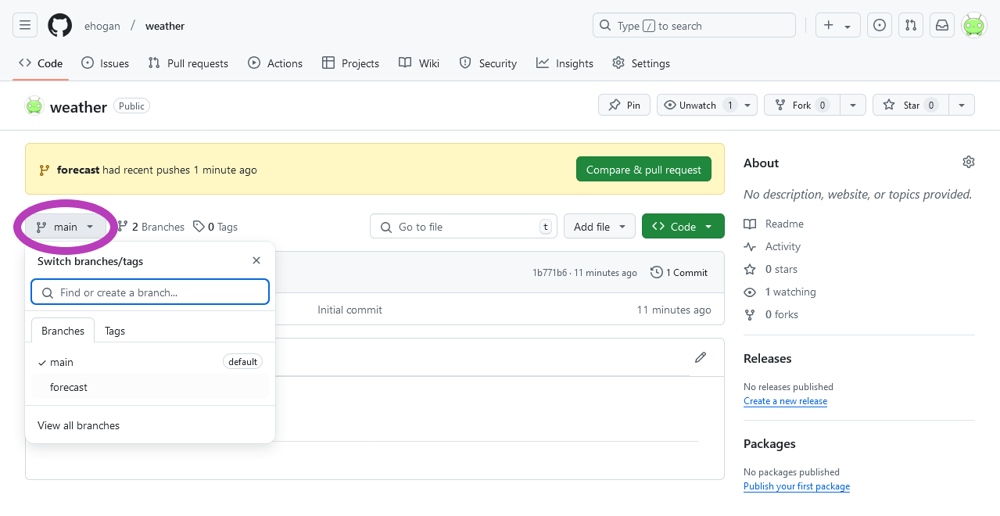
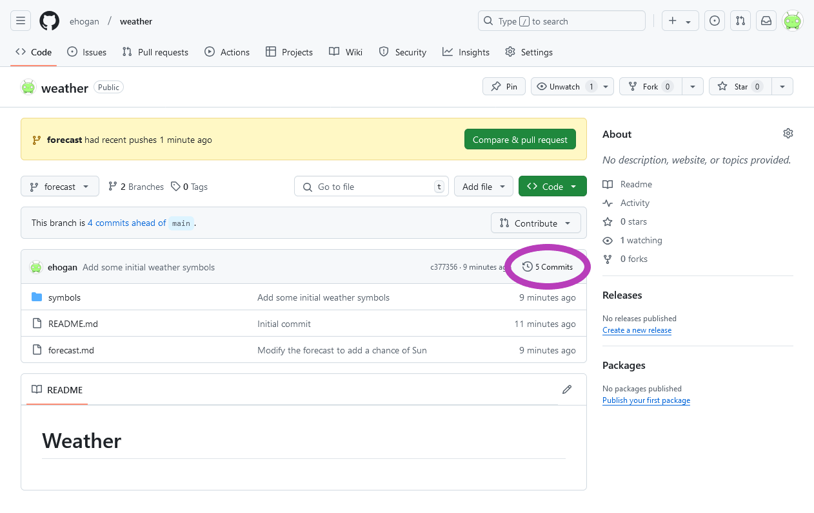
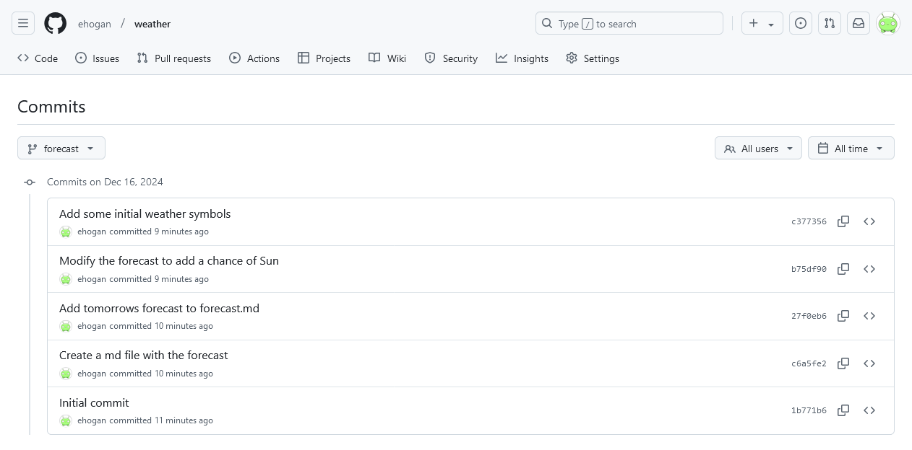
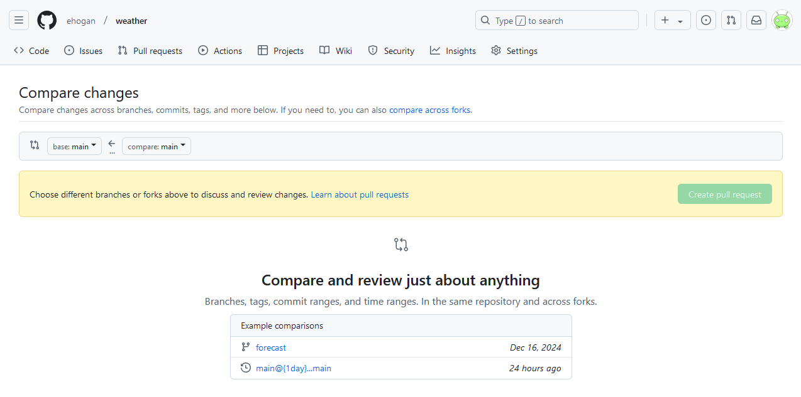
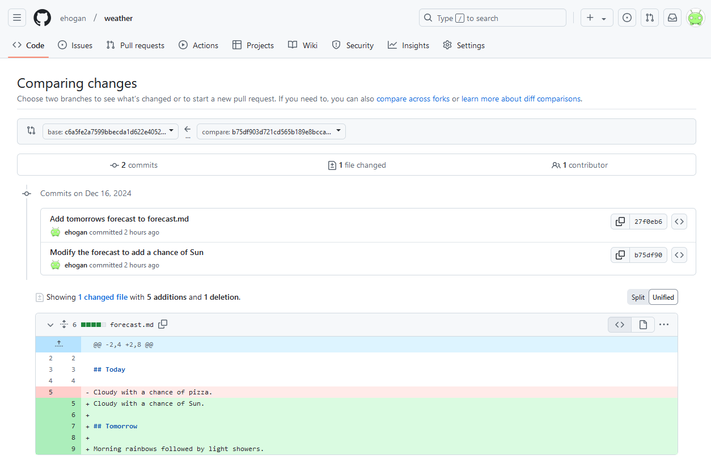

::::::::::::::::::::::::::::::::::::::: objectives

- Recognise and use Git commit unique identifers (SHAs).
- Compare various versions of tracked files.

::::::::::::::::::::::::::::::::::::::::::::::::::

:::::::::::::::::::::::::::::::::::::::: questions

- How can I identify old versions of files on GitHub?
- How do I review my changes on GitHub?

::::::::::::::::::::::::::::::::::::::::::::::::::

## Viewing the History of a Repository on GitHub

In an earlier episode,
we used `git log` on the command line in our local repository
to show the commits to our branch.

We can also see the commits to our branch on GitHub.
But first we need to push our local branch to GitHub.

Make sure you are on the `forecast` branch:

```bash
$ git switch forecast
```

Now we can push our local branch to GitHub:

```bash
$ git push
```

Navigate to your `weather` GitHub repo:

{alt='A screenshot of the main branch of weather repository on GitHub.'}

Select the `forecast` branch from the branch drop down box labelled `main`:

{alt='A screenshot of the main branch of weather repository on GitHub, showing the branch drop down box.'}

Click on `Commits`:

{alt='A screenshot of the forecast branch of weather repository on GitHub, showing how to navigate to the commits.'}

This commits page shows all the commits on your branch:

{alt='A screenshot of the commit on the forecast branch of the weather repository on GitHub.'}

The Git commit unique identifiers (SHAs) here on GitHub
match with those shown after running `git log` on the command line
in your local branch.

## Viewing Differences Between Commits

In an earlier episode,
we used `git diff` on the command line in our local repository
to show the differences between two commits on our branch.

We can also see these differences on GitHub.

In a new tab, navigate to your `weather` GitHub repo
then add `compare` to the end of the URL.
The URL should follow `https://github.com/<your-user-name>/weather/compare`:

{alt='A screenshot of the compare page for the weather repository on GitHub.'}

Select one of the Git commit SHAs from the `Commits` page
and add it to the first drop down box labelled `base: main`.

Then select a second Git commit SHA from the `Commits` page
and add it to the second drop down box labelled `compare: main`.

The resulting page will show the differences between the two Git commit SHAs:

{alt='A screenshot showing the differences between two Git commit SHAs from the weather repository on GitHub.'}`

:::::::::::::::::::::::::::::::::::::::: keypoints

- The `Commits` page displays the history for the specified branch.
- Adding `compare` to the end of the repository URL displays differences between commits.

::::::::::::::::::::::::::::::::::::::::::::::::::
