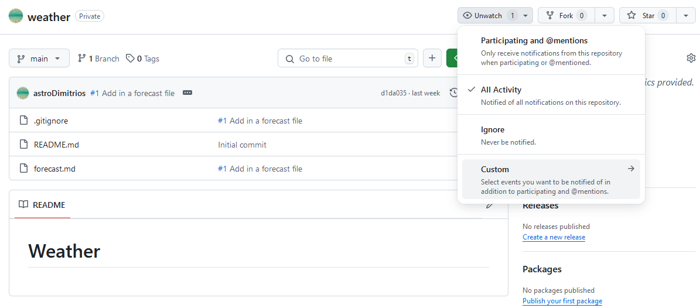
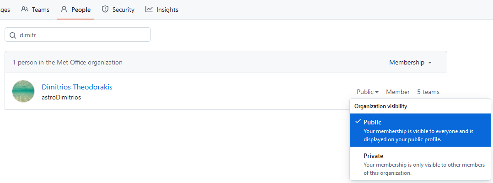

::::::::::::::::::::::::::::::::::::::: objectives

- Configure your GitHub profile and settings.

::::::::::::::::::::::::::::::::::::::::::::::::::

:::::::::::::::::::::::::::::::::::::::: questions

- How do I edit my GitHub profile?
- How do I change my notification preferences?
- How do I change my organisation membership visibility,
  and team memberships?

::::::::::::::::::::::::::::::::::::::::::::::::::

In this section we will look at configuring some optional GitHub
settings on both a GitHub wide and repository level. 

## Profile Settings

You access your profile settings by navigating to:
[https://github.com/settings/profile](https://github.com/settings/profile)

Working down the page:

1. Set your preferred name. This helps collaborators find you on GitHub.
2. Set a public email, this also helps collaborators find your profile.
   To keep your email address private click on **email settings**,
   then tick the **Keep my email addresses private** checkbox.
3. Set your pronouns.
4. If you have a professional website you can add a link to the URL section.
5. If you have an [ORCID](https://orcid.org/) you can link your GitHub
   profile to your ID.
6. If you would like to display your organisational affiliation add
   `@<organisation-name>` to the Company section.

You can also set a profile picture on this page.
Click on the green **Update profile** button when you have
finished making changes.

{alt='A screenshot of a users GitHub profile.'}

You can also make profile changes directly from your profile
by clicking on the **Edit profile** button.

## Configuring Notifications

To configure general notification settings navigate to:
[https://github.com/settings/notifications](https://github.com/settings/notifications)

Here you can choose a default email for notifications,
and set up **Custom routing**.
Custom routing allows you to specify different emails
for each organisation you are a member of.

In the **Subscriptions** section you can decide
whether to receive notifications via GitHub, email, or both.

### Repository Notifications

You can customise notifications on a repository level.
Since you created the `weather` repository you are
automatically watching **All Activity**.
Click on the **Unwatch** dropdown to change your notification settings.

{alt='A screenshot of the GitHub weather repo with the Unwatch dropdown expanded.'}

The same dropdown will display **Watch** on repositories
that do not belong to you.

## Organisation Membership

If you are a member of an organisation you can make your membership
of the organisation public or private by navigating to:
`https://github.com/orgs/<organisation-name>/people`

Search for your name and click on the right hand dropdown
to change your organisation visibility.

{alt='A screenshot of the GitHub organisation People settings for an organisation showing how to change your organisation visibility.'}

The default visibility setting will depend on your organisation.
If you set the visibility to public your membership will appear
on your profile, `https://github.com/<your-username>/`,
near the bottom left of the screen.

## Teams Membership

One across from the People settings are the Teams settings:
`https://github.com/orgs/<organisation-name>/teams`.
You can leave, request to join, or if you are an admin add members
to your GitHub team here.
[Teams](https://docs.github.com/en/organizations/organizing-members-into-teams/about-teams)
let you manage access to repositories
for a group of people all at once.
Some organisations restrict the creation of GitHub teams to central admins.

:::::::::::::::::::::::::::::::::::::::: keypoints

- You access your GitHub profile settings by navigating to:
  [https://github.com/settings/profile](https://github.com/settings/profile).
- To configure general GitHub notification settings navigate to:
  [https://github.com/settings/notifications](https://github.com/settings/notifications).
- Click on the **Watch** or **Unwatch** repository dropdown button to
  change notifications for specific repositories.

::::::::::::::::::::::::::::::::::::::::::::::::::
