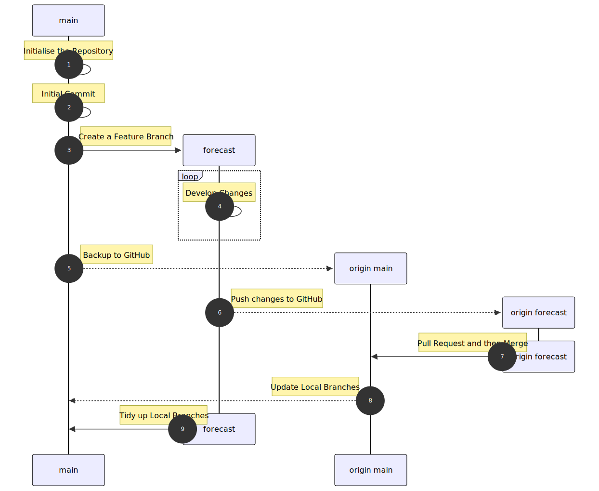

This marks the end of the GitHub section and the workshop.
Please remember to fill out your post-workshop feedback.
This feedback is vital for us to keep improving the lesson
for other learners.

## Where to next?

The Git & GitHub Working Practices lesson teaches you how to work
collaboratively with others using Git and GitHub.
It explores more complex workflows and topics,
building on from this lesson.

There are also a number of optional episodes after this page
which focus on open science and code which you can read
in your own time.

You can revisit this training anytime.
Useful page links:

- [Glossary](../learners/reference.md#glossary)
- [Key Points](./key-points.html)
- [Discussion](../learners/discuss.md) page with extra information on some episodes
- [FCM to Git](../learners/fcm-git_cheat_sheet.md) cheat sheet
- [Git cheatsheets](../learners/reference.md)

You can keep your weather repositories around to practice with
for as long as you like and
when you are ready to delete them use the instructions
at the end of this page.

## Summary

You've now created a repository both locally on your computer
and remotely on GitHub.
You've developed changes on a feature branch,
reviewed the changes on GitHub and merged them into `main`.
The diagram below outlines the workflow you used during the course:

{alt='A sequence diagram showing the workflow we used during the lesson.'}

A summary page outlining the steps we've taken to create
a new repository locally and connect it to a GitHub remote
can be found in the extra [Quick Start Repository Guide](../learners/repo-quick-start.md).

## Deleting a Repository

Make sure you are certain you want to delete the repository.
If you delete both the local and GitHub repositories you won't be able
to recover your files!

### Deleting a Local Repository

```bash
$ cd ~/Desktop
$ rm -rf weather
```

### Deleting a GitHub Repository

1. Navigate to `https://github.com/<your-username>/weather/settings`
2. Scroll down to the last setting in the **Danger Zone**
3. Click on `Delete this repository`

You will be asked to confirm twice that you understand the effects
of deleting the repository.
You will also be asked to type out `<your-username>/weather`
to confirm the deletion and you may have to confirm the deletion
using MFA or your passkey.
