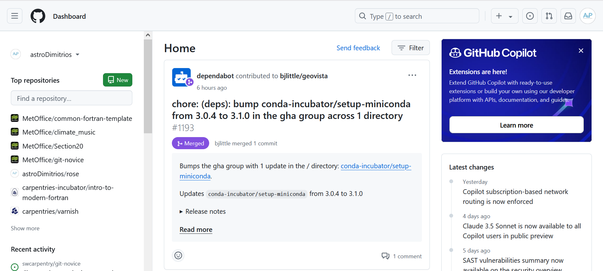
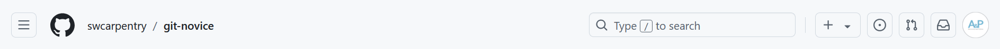

::::::::::::::::::::::::::::::::::::::: objectives

- Navigate around the GitHub interface.

::::::::::::::::::::::::::::::::::::::::::::::::::

:::::::::::::::::::::::::::::::::::::::: questions

- How do I search a repository?

::::::::::::::::::::::::::::::::::::::::::::::::::

GitHub has a lot of features so we'll take some time to learn 
how to navigate the interface. Your instructor will guide you through navigating 
each section.

{alt='The GitHub home page showing repositories on the left, and news in the centre.'}

This is the GitHub homepage. On the left you can quickly navigate to a repository 
or use the green `New` button to create a new repository. If you are in an 
organisation that requires single sign on to see organisational repositories 
you will be prompted with a large green button at the top of this page to sign in.

To access your settings click on your round profile icon in the top right 
hand corner and select the `Settings` option.

### 1 Exploring the interface for a repository

The following image shows an example repository. In fact it is the repository 
containing the material for this lesson.
[Link to the git-novice repository](https://github.com/swcarpentry/git-novice/).

{alt='A screenshot of the GitHub repository for the git-novice lesson.'}

Let's break it down into parts:

{alt='The GitHub nav at the top of a repository.'}

When you navigate to a repository the top nav will display the 
organisation the repository belongs to, `swcarpentry`, and the name of the 
repository, `git-novice`, in the top left.
In the top right you have access to GitHubs powerful search, buttons to open 
Issues and Pull requests (which will be explained later), and the notifications 
and profile icon on the far right.

{alt='The GitHub navigation tabs for a repository.'}

This next section displays tabs to navigate around your repository and various 
buttons which allow you to watch for changes to a repository and star a project.
Starring a repo makes it easier to find from your homepage and helps 
repository owners gauge usage of their code.

{alt='A screenshot of the lower section of the repository interface.'}

This section displays the code contained on the default branch, in this case `main`.
It also displays useful stats about the repository on the right.
The green `<> Code` button lets you check out a local copy of the repository.

:::::::::::::::::::::::::::::::::::::::: keypoints

- Quickly navigate to a repository in your browser using the url pattern:
  `https://github.com/<username or organisation>/<repo name>`

::::::::::::::::::::::::::::::::::::::::::::::::::
