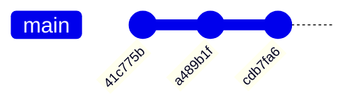
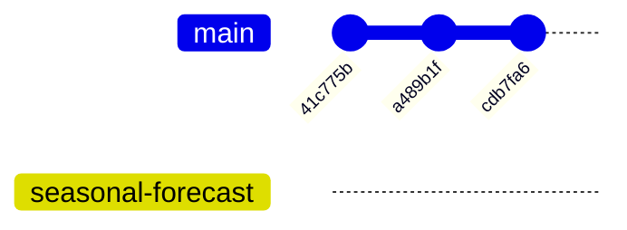
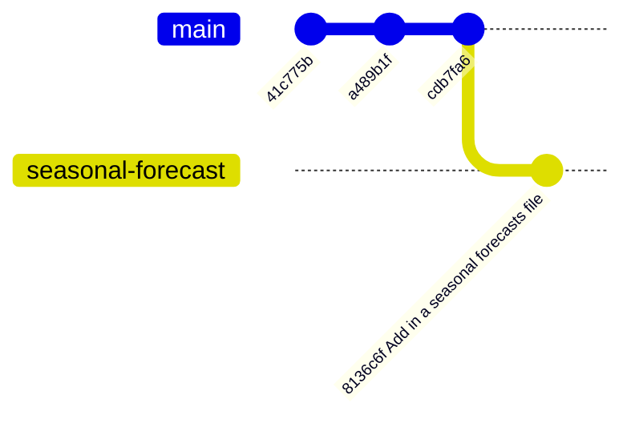

::::::::::::::::::::::::::::::::::::::: objectives

- What are branches?
- How do I view the current branches?
- How do I manipulate branches?

::::::::::::::::::::::::::::::::::::::::::::::::::

:::::::::::::::::::::::::::::::::::::::: questions

- Understand how branches are created.
- Learn the key commands to view and manipulate branches.

::::::::::::::::::::::::::::::::::::::::::::::::::

Branching is a feature available in most modern version control systems.
Branching in other version control systems can be an expensive operation in both time and disk space.
In git, branches are a part of your everyday development process.

So far we have been working on the `main` branch.
From this point on you should **NEVER** commit to `main`.
When you want to add a new feature or fix a bug—no matter how big or how 
small — you create a new branch for your changes.
This makes it harder for unstable code to get merged into the main code base, 
and it gives you the chance to clean up your branch history before merging it into the main branch.

If you completed the pre-workshop [setup instructions for git autocomplete](learners/setup.md#git-autocomplete)
you should see the current branch, `main`, in your terminal prompt:

```bash
[~/Desktop/weather]:(main =)$
```

The `git status` command we have been using throughout earlier episodes
also shows us the current branch:

```bash
$ git status
```

```output
On branch main
Your branch is up to date with 'origin/main'.

nothing to commit, working tree clean
```

::: callout

### What are Branches?

Remember a git commit is a snapshot of files, it has no branch information. Commits simply point to the previous 'parent' commits, forming a graph, and a branch is nothing more than a reference (pointer) to a commit.

More practically you can think of a branch as a list of commits that are accessible from the branch's reference but not from main.

:::

## Creating Branches

Our current repository looks something like this:



All our commits, the circles with commit IDs, are on the main branch,
the horizontal grey line.

Say we want to add a longer seasonal forecast to our repository.
We should make a branch to develop our changes on.
There are several ways to create a branch and switch to the new branch.
While it's good to be aware of all these different methods we
recommend using `git switch -c`

You should ensure the branch has a suitable name 
which will help you identify what the branch is for; even after several 
months of inactivity.

::: tab

### git switch -c

`git switch` is a more modern command to navigate between branches.
`git switch` used with the `-c` flag automatically creates and 
switches you to a new branch:

```bash
$ git switch -c seasonal-forecast
```

```output
Switched to branch 'seasonal-forecast'
```

### git branch

To create a new branch use `git branch <branch-name>`:

```bash
$ git branch seasonal-forecast
```

Now run `git status` and you will see you're still on the main branch.
To navigate between branches use `git switch <branch-name>`:

```bash
$ git switch seasonal-forecast
```

```output
Switched to branch 'seasonal-forecast'
```

### git checkout -b

The `git checkout` command can also be used to navigate between branches.
`git checkout` used with the `-b` flag automatically
creates and switches you to the new branch:

```bash
$ git checkout -b seasonal-forecast
```

```output
Switched to branch 'seasonal-forecast'
```

:::

Running `git status` now should output:

```bash
$ git status
```

```output
On branch seasonal-forecast
nothing to commit, working tree clean
```

We haven't added anything yet so there is nothing to commit and our
repository looks like this:



If we run `git branch` we can see the branches that exist in our repository.

```bash
$ git branch
```

```output
  main
* seasonal-forecast
```

The `*` indicates we are now on the `seasonal-forecast` branch.

::::::::::::::::::::::::::::::::::::: challenge

## Switching Between Branches

How would you switch back to the `main` branch from the `seasonal-forecast` branch?

:::::::::::::::: solution

```bash
$ git switch main
```

:::::::::::::::::::::::::
:::::::::::::::::::::::::::::::::::::::::::::::

::::::::::::::::::::::::::::::::::::: challenge

## Typos when creating branches

Help! Luca made a typo when naming their branch, `seesonal-forecast`,
how can they fix the branch name?

Hint: Look at the git documentation for the `git branch` command.

:::::::::::::::: solution

The `-m` flag used with `git branch` lets you rename a branch.

```bash
$ git branch -m <old-branch-name> <new-branch-name>
```

:::::::::::::::::::::::::
:::::::::::::::::::::::::::::::::::::::::::::::

::::::::::::::::::::::::::::::::::::: challenge

## Branch start-points

The commands we used above created a branch from the 
`HEAD` of the `main` branch 
because we ran `git switch` from `main`.
How would you create a branch that branched off at an
earlier commit that isn't `HEAD`? 

Hint: Look at the git documentation for the `git switch` command.

:::::::::::::::: solution

The `git switch` command lets you define a `<start-point>` to
branch from:

```bash
$ git switch -c <branch-name> <start-point>
```

`<branch-name>` is the name of the new branch.
`<start-point>` can be a branch name, a commit-id, or a tag.

This functionality also applies to the `git branch` command:

```bash
git branch <branch-name> <start-point>
```

:::::::::::::::::::::::::
:::::::::::::::::::::::::::::::::::::::::::::::

## Developing on a Branch

Developing your changes on a branch is exactly the same as you practised
in earlier episodes.
Let's add a `seasonal-forecast.md` file:

```bash
$ nano seasonal-forecast.md
$ cat seasonal-forecast.md
```

```output
# Seasonal Forecast

- Winter is cold
- Summer is hot
```

And commit these changes:

```bash
$ git add seasonal-forecast.md
$ git commit -m "Add in a seasonal forecasts file"
```

```output
[seasonal-forecast 8136c6f] Add in a seasonal forecasts file
 1 file changed, 4 insertions(+)
 create mode 100644 seasonal-forecast.md
```

Now our repository looks like this:



In the next episode we will explore a simple workflow to merge these
changes back into the `main` branch using GitHub.

## Deleting Branches

A colleague of yours gets really excited about using branches and creates a new one:

```bash
$ git switch -c shipping-forecast
```

```output
Switched to a new branch 'shipping-forecast'
```

In their excitement they forgot to switch back to the `main` branch 
before running the `git switch -c` command.
They have inadvertently branched off a branch that isn't `main`.
Running `git branch` with the `-vv` verbosity flag gives:

```bash
$ git branch -vv
```

```output
  main              41c775b [origin/main] Ignore png files and the data folder.
  seasonal-forecast 8136c6f Add in a seasonal forecasts file
* shipping-forecast 8136c6f Add in a seasonal forecasts file
```

The `shipping-forecast` output line references the same commit as the `seasonal-forecast` one!
This means the `shipping-forecast` branch was created from the `seasonal-forecast` branch at commit `8136c6f`.

Sometimes it will make sense to branch off of branches that are not `main`.
In this case your colleague decides to delete the branch since they haven't made any commits to it yet. To delete a branch first switch to any other branch:

```bash
$ git switch main
```

and then delete the branch with `git branch -d`:

```bash
$ git branch -d shipping-forecast
```

```output
error: The branch 'shipping-forecast' is not fully merged.
If you are sure you want to delete it, run 'git branch -D shipping-forecast'.
```

Notice our branch wasn't deleted!
Git is telling us we didn't merge our changes onto another branch and might lose commits.
Your colleague knows it is safe to delete the `shipping-forecast` branch 
because it contains no commits.
They go ahead and run the suggested command with the `-D`, force delete, flag:

```bash
$ git branch -D shipping-forecast
```

```output
Deleted branch shipping-forecast (was 8136c6f).
```

::::::::::::::::::::::::::::::::::::: challenge

## Deleting a branch that is checked out

What happens if you:

1. Create a new branch and switch to it
2. Try to delete the new branch while it's checked out

:::::::::::::::: solution

Git won't let you delete a branch you are currently on!
Try it for yourself:

```bash
$ git switch -c climate
$ git branch -D climate
```

```output
error: Cannot delete branch 'climate' checked out at '~/Documents/weather'
```

Note that even with the `-D`, force delete, flag the branch wasn't deleted.

:::::::::::::::::::::::::
:::::::::::::::::::::::::::::::::::::::::::::::

:::::::::::::::::::::::::::::::::::::::: keypoints

- `git status` shows you the branch you're currently on.
- `git switch -c <branch-name>` creates a new branch and switches you to it.
  Make sure you know what branch you are branching from before using `git switch` without a start-point!
- `git switch -c <branch-name> <start-point>` lets you define the start-point to branch off, via another branch name, a commit ID, or a tag.
- `git switch <branch-name>` switches you to another branch that already exists.
- `git branch -vv` shows you all the branches in the repository.
- `git branch -m <old-branch-name> <new-branch-name>` renames branches.
- `git branch -d <branch-name>` deletes a branch. Use the `-D` flag instead of `-d` to force delete the branch.

::::::::::::::::::::::::::::::::::::::::::::::::::
