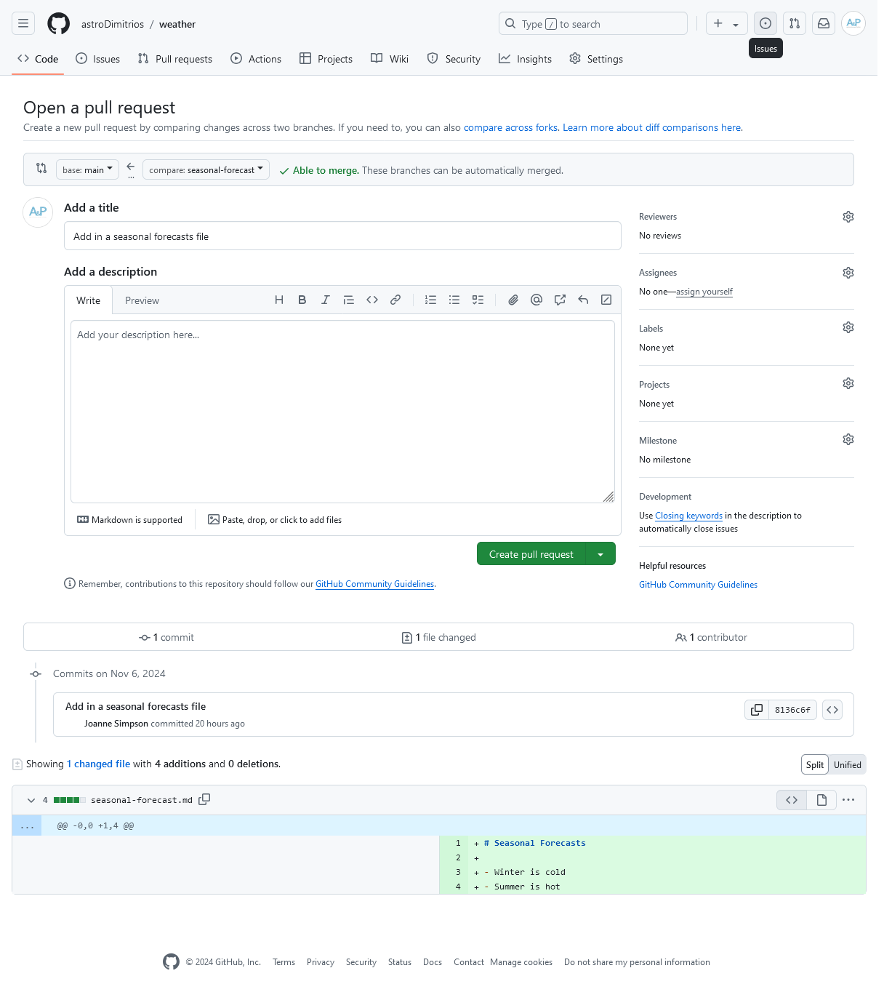
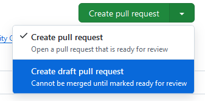
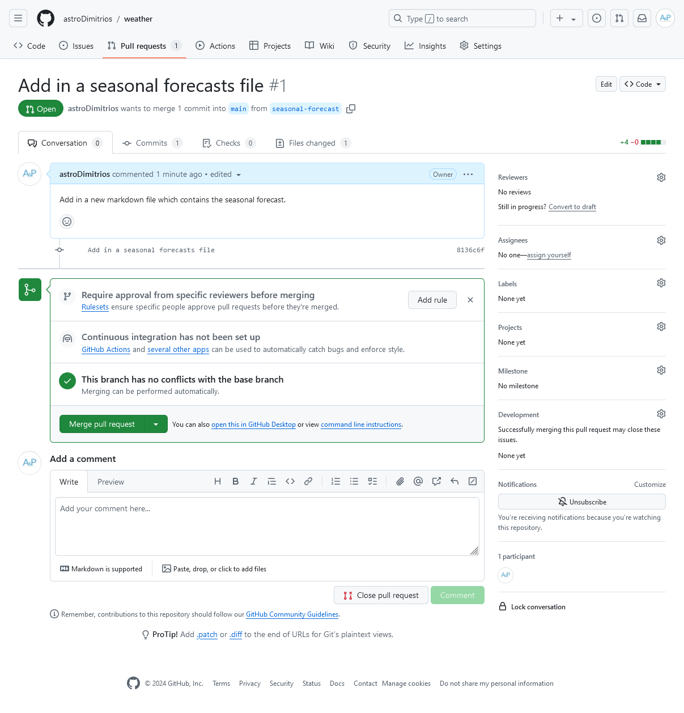
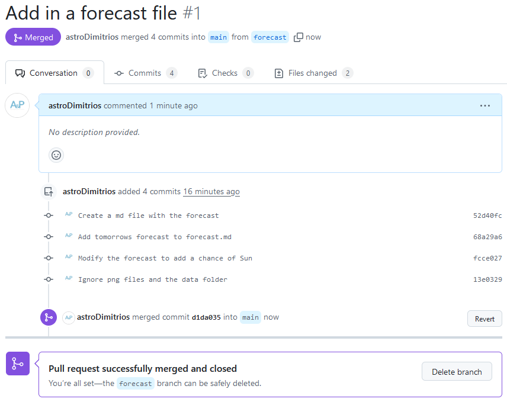

::::::::::::::::::::::::::::::::::::::: objectives

- Make a pull request and describe what they are useful for

::::::::::::::::::::::::::::::::::::::::::::::::::

:::::::::::::::::::::::::::::::::::::::: questions

- What are pull requests for?
- How can I make a pull request?

::::::::::::::::::::::::::::::::::::::::::::::::::

Pull requests are a great way to collaborate with others using GitHub.
Instead of making changes directly to a repository
you can suggest changes to a repository using a pull request.

Pull requests are where your changes go through the 
vital steps of code and science review.
Some of these code and science checks can be completely
automated using pull requests (PRs).
This helps speed up the review process and 
reduce the chance of human error when checking new code.

## Creating a Pull Request

In the previous episodes we developed our changes 
on the `forecast` branch.
Let's use a PR to merge these changes back into the `main` branch.

Navigate to your `weather` GitHub repo. 
You should see a notification appear with the text
**`forecast` had recent pushes**.

{alt='A screenshot of the weather repo showing the notification prompting us to Compare & pull request for the forecast branch.'}

Click on the green **Compare & pull request** button.

{alt='A screenshot of the weather repo showing the creation of a pull request for the forecast branch changes.'}

This page lets us create a new pull request from the
`forecast` branch.
The title has been autofilled with the message of the last commit.
You can see all the commits on the branch at the bottom of this page.

Make sure the title and description are clear.
Then press the green **Create pull request** button.

::: callout

### Draft Pull Requests

If your changes are not ready for review yet you can 
mark the pull request as a draft:

{alt='A screenshot showing the dropdown to swap from a normal pull request to a creating a draft pull request.'}

Draft pull requests can't be merged and code reviewers
aren't automatically assigned.

:::

{alt='A screenshot showing an open pull request on the weather repo.'}

Notice we've now moved to the **Pull Requests** tab.
This is PR **#1** and underneath the title we see:

> wants to merge 4 commits into `main` from `forecast`

If you need to change the title or the branch you're merging into,
in this case `main`, click on the **edit** button 
to the far right of the title.

The PR has four tabs below the title section:

- **Conversation** is where code and science reviews occur
- **Commits** shows all the commits we want to merge
- **Checks** shows the output from any automated code and science checks
- **Files Changed** shows a diff (difference) between the 
  branch with your changes, `forecast`,
  and the target branch, `main`.

At this point you should use the diff in the **Files changed** tab to check your changes.

## Rulesets

GitHub [Rulesets](https://docs.github.com/en/repositories/configuring-branches-and-merges-in-your-repository/managing-rulesets/about-rulesets) control how people can
interact with your repository.

When we opened our first PR we were prompted to **Require approval from specific reviewers before merging**. Click on the **Add rule** button.

This page lets us create a rule preventing anyone from committing directly
into the `main` branch.
All repositories should have some form of protection using these rulesets.
To add a rule to protect the `main` branch:

1. Enter the **Ruleset Name** `main`
2. Change the **Enforcement status** to `Active`
3. Scroll down to **Target branches**.
   Click **Add target** and select **Default branch**
   (which in our `weather` repo is `main`).
4. Scroll down to **Rules**.
   Tick the **Require a pull request before merging** option.
5. At the bottom of the page click the green **Create** button.

Now even if you commit to `main` locally you will not be able to push
those changes to GitHub.
To add changes you **MUST** open a PR and go through code and science review.

::: spoiler

### Screenshot of the Rule Protecting Main

{alt='A screenshot showing the creation of a rule to protect the main branch in the repository settings, rulesets page.'}

:::

::: caution

### Private Personal Repos

Rulesets cannot be created on private repos in your personal space
unless you have a paid GitHub plan.

:::

## Merging a Pull Request

Navigate back to your PR.
To merge the PR click on the dropdown, and select **Squash and merge**.
Squashing before merging will combine all the commits on your branch
and 'squash' them into a single new commit on the target branch, in this case `main`.
This helps keep the commit history of the `main` branch tidy and linear[^squash-merge].

{alt='A screenshot showing the dropdown to swap from a normal merge to a squash merge.'}

Once you've selected the squash option click on the green
**Squash and merge** button.
Edit the commit title and description if necessary.
Then click on **Confirm squash and merge**.

{alt='A screenshot showing a closed pull request on the weather repository.'}

The PR is now successfully merged into the `main` branch.
We can safely delete the `forecast` branch from the GitHub repo.
Click on the **Delete branch button**.

### Updating your Local Repo

The new `forecast.md` file is currently only on the `main` branch in GitHub.
We should pull the changes down to our local copy.
Switch to the `main` branch:

```bash
$ git switch main
```

Pull down the changes from GitHub:

```bash
$ git pull
```

```bash
remote: Enumerating objects: 4, done.
remote: Counting objects: 100% (4/4), done.
remote: Compressing objects: 100% (2/2), done.
remote: Total 3 (delta 1), reused 2 (delta 1), pack-reused 0 (from 0)
Unpacking objects: 100% (3/3), 1.01 KiB | 173.00 KiB/s, done.
From github.com:mo-eormerod/weather
   41c775b..49c845c  main       -> origin/main
Updating 41c775b..49c845c
Fast-forward
 .gitignore  | 2 ++
 forecast.md | 9 +++++++++
 2 files changed, 11 insertions(+)
 create mode 100644 .gitignore
 create mode 100644 forecast.md
```

::: callout

### How do I know there are Changes to Pull?

`git pull` actually runs two commands:

```bash
$ git fetch
$ git merge
```

The `git fetch` command fetches any changes on the GitHub remote.
Then `git merge` merges those changes into your local branch.

If you're not sure if there are changes to pull;
or you're not sure you want to merge the changes right away 
run `git fetch` and examine the output before running `git pull`.

Example `git fetch` output showing changes on the remote `main` branch being fetched:

```output
remote: Enumerating objects: 4, done.
remote: Counting objects: 100% (4/4), done.
remote: Compressing objects: 100% (2/2), done.
remote: Total 3 (delta 1), reused 2 (delta 1), pack-reused 0 (from 0)
Unpacking objects: 100% (3/3), 1010 bytes | 144.00 KiB/s, done.
From github.com:mo-ormerod/weather
   49c845c..e4bdab8  main       -> origin/main
```

:::

### Cleaning up your Local Branches

We deleted our `forecast` dev branch from GitHub
but we still have a local copy.
Let's tidy up by deleting it.
To see all our branches including remote GitHub branches run:

```bash
$ git branch -avv
```

```output
  forecast                13e0329 [origin/forecast] Ignore png files and the data folder
* main                    d1da035 [origin/main] #1 Add in a forecast file
  remotes/origin/forecast 13e0329 Ignore png files and the data folder
  remotes/origin/main     d1da035 #1 Add in a forecast file
```

The first two branches are our local branches, the last two are the GitHub remotes.
To remove references to remote branches that have been deleted on GitHub run:

```bash
$ git remote prune origin
```

```ouput
Pruning origin
URL: git@github.com:mo-eormerod/weather.git
 * [pruned] origin/forecast
```

Running `git branch -avv` again now shows:

```ouptut
  forecast            13e0329 [origin/forecast: gone] Ignore png files and the data folder
* main                d1da035 [origin/main] #1 Add in a forecast file
  remotes/origin/main d1da035 #1 Add in a forecast file
```

You can see the remote reference for the `forecast` branch
has been removed.
The second line with the local `forecast` branch now has
`gone` in the brackets referencing the remote branch.

To delete our local branch run:

```bash
$ git branch -D forecast
```

Running `git branch -avv` again now shows:

```output
* main                d1da035 [origin/main] #1 Add in a forecast file
  remotes/origin/main d1da035 #1 Add in a forecast file
```

You've now successfully merged and tidied up after your first pull request.
Remember when making changes create a new branch
and open a PR, **NEVER** commit to the `main` branch.

::::::::::::::::::::::::::::::::::::: challenge

## Adding in a seasonal-forecast.md file

Try adding in a seasonal forecast using the following steps:

1. Create a new branch with an appropriate name and switch to it
2. Create the `seasonal-forecast.md` file
3. Add and commit the new file
4. Push the changes to GitHub
5. Open a PR on GitHub
6. Merge the PR, delete the branch on GitHub
7. Pull down the changes to your local copy
8. Tidy up your branches

:::::::::::::::: solution

1. Create a new branch with an appropriate name and switch to it

```bash
$ git switch -c add-seasonal-forecast
```

```output
Switched to a new branch 'add-seasonal-forecast'
```

2. Create the `seasonal-forecast.md` file

```bash
$ nano seasonal-forecast.md
$ cat seasonal-forecast.md
```

```output
# Seasonal Forecast

- Winter is wet
- Summer is hot
```

3. Add and commit the new file

```bash
$ git add seasonal-forecast.md
$ git commit -m "Add in a seasonal-forecast.md file"
```

```output
[add-seasonal-forecast aeaf804] Add in a seasonal-forecast.md file
 1 file changed, 4 insertions(+)
 create mode 100644 seasonal-forecast.md
```

4. Push the changes to GitHub

```bash
$ git push
```

```output
Enumerating objects: 4, done.
Counting objects: 100% (4/4), done.
Delta compression using up to 4 threads
Compressing objects: 100% (3/3), done.
Writing objects: 100% (3/3), 326 bytes | 163.00 KiB/s, done.
Total 3 (delta 1), reused 0 (delta 0), pack-reused 0
remote: Resolving deltas: 100% (1/1), completed with 1 local object.
remote: 
remote: Create a pull request for 'add-seasonal-forecast' on GitHub by visiting:
remote:      https://github.com/mo-ormerod/weather/pull/new/add-seasonal-forecast
remote: 
To github.com:mo-ormerod/weather.git
 * [new branch]      add-seasonal-forecast -> add-seasonal-forecast
branch 'add-seasonal-forecast' set up to track 'origin/add-seasonal-forecast'.
```

5. Open a PR as shown in this very episode!
6. Merge the PR, delete the branch on GitHub
7. Pull down the changes to your local copy

Switch to main:

```bash
$ git switch main
```

If you want to check if there are changes to pull:

```bash
$ git fetch
```

```output
remote: Enumerating objects: 4, done.
remote: Counting objects: 100% (4/4), done.
remote: Compressing objects: 100% (2/2), done.
remote: Total 3 (delta 1), reused 2 (delta 1), pack-reused 0 (from 0)
Unpacking objects: 100% (3/3), 1010 bytes | 144.00 KiB/s, done.
From github.com:mo-ormerod/weather
   49c845c..e4bdab8  main       -> origin/main
```

Then merge the changes:

```bash
$ git pull
```

```output
Updating 49c845c..e4bdab8
Fast-forward
 seasonal-forecast.md | 4 +++
 1 file changed, 4 insertions(+)
 create mode 100644 seasonal-forecast.md
```

8. Tidy up your branches

```bash
$ git remote prune origin
```

```output
Pruning origin
URL: git@github.com:mo-ormerod/weather.git
 * [pruned] origin/add-seasonal-forecast
```

```bash
$ git branch -D add-seasonal-forecast
```

```output
Deleted branch add-seasonal-forecast (was aeaf804).
```

:::::::::::::::::::::::::
:::::::::::::::::::::::::::::::::::::::::::::::

:::::::::::::::::::::::::::::::::::::::: keypoints

- A pull request (PR) is where your changes go through code and science review.
- PRs can contain automated checks to help speed up the review process and
  avoid human error.
- The PR will automatically create an easy to read diff (difference) 
  of the changes for the review (in the **Files changed** tab).
- Squashing and merging takes all the commits in your PR and 'squashes'
  them into a single new commit on the target branch.
- `git fetch` fetches changes to the GitHub remote.
- `git pull` pulls and merges changes to the GitHub remote into your local copy.
- `git branch -avv` displays all your local branches including references
  to any remote branches.
- `git remote prune origin` removes references to remote branches that
  have been deleted on GitHub.

::::::::::::::::::::::::::::::::::::::::::::::::::

[^squash-merge]: [Microsoft Azure Learning Squash Merge](https://learn.microsoft.com/en-us/azure/devops/repos/git/merging-with-squash?view=azure-devops)
