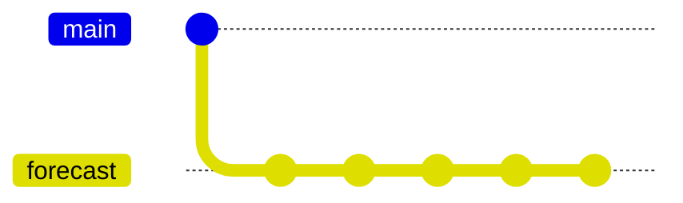

This marks the end of the git section.
Take a break and remember to fill out your minute card feedback.

## Summary

You've now used Git to create a repository
and made some commits on a feature branch.
Your repository will look something like this:

Your repo may have a different number of commits on the forecast branch
depending on which challenge exercises you have completed.
You can find short summaries of all the new commands
you've learnt on the Key Points page.
