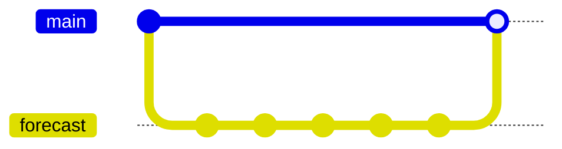

This marks the end of the GitHub section and the workshop.
Please remember to fill out your post-workshop feedback.
This feedback is vital for us to keep improving the lesson
for other learners.

## Where to next?

The Git working practices lesson teaches you how to work
collaboratively with others using git and GitHub.

There are also a number of optional episodes after this page
which focus on open science and code which you can read
in your own time.

You can revisit this training anytime.
Useful page links:

- [Glossary](../learners/reference.md#glossary)
- [Key Points](./key-points.html)
- [Discussion](../learners/discuss.md) page with extra information on some episodes
- [FCM to Git](../learners/fcm-git_cheat_sheet.md) cheat sheet
- [Git cheatsheets](../learners/reference.md)

## Summary

You've now created a repository both locally on your computer
and remotely on GitHub.
You've developed changes on a feature branch,
reviewed the changes on GitHub and merged them into `main`.
Your local and remote repositories look something like this:

A summary page outlining the steps we've taken to create
a new repository locally and connect it to a GitHub remote
can be found in the extra [Quick Start Repository Guide](../learners/repo-quick-start.md).
